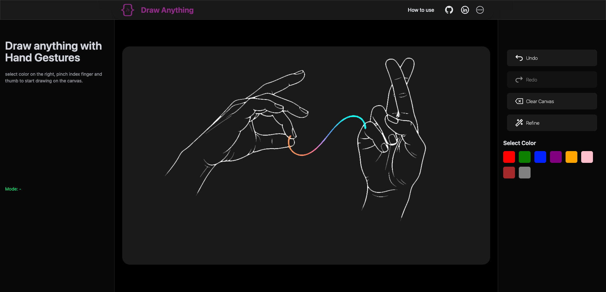

# 🎨 Draw Anything

Draw Anything is an innovative web application that transforms your hand movements into digital art! Utilizing **MediaPipe** for real-time hand tracking and **React** for a dynamic user experience, this app allows you to draw in the air with just your fingers. What's more, it soon integrating **Google Gemini AI** to add a touch of magic, letting you refine your creations into polished, artistic masterpieces.

---

## ✨ Features

- **Real-time Hand Tracking:** Draw effortlessly using your index finger and thumb, powered by MediaPipe.
- **Intuitive Drawing Controls:** Pinch your index finger and thumb to start drawing, and release to stop.
- **Customizable Colors:** Select from a palette of vibrant colors to bring your drawings to life.
- **Drawing History:** **Undo** and **Redo** your strokes, giving you complete control over your creative process.
- **Clear Canvas:** Easily wipe the slate clean to start a new masterpiece.
- **AI-Powered Refinement:** (Coming soon) Enhance your rough sketches into refined, artistic illustrations with a single click, thanks to **Google Gemini AI**.
- **Responsive and Modern UI:** A clean, intuitive interface built with **Tailwind CSS** ensures a seamless experience across devices.
- **Browser-Based:** No installations or downloads needed—start creating directly in your web browser!

---

## 💻 Tech Stack

- **Frontend:**
  - [React](https://react.dev/)
  - [Vite](https://vitejs.dev/)
  - [Tailwind CSS](https://tailwindcss.com/)
- **Hand Tracking:**
  - [MediaPipe Hands](https://developers.google.com/mediapipe/solutions/vision/hand_landmarker)
- **AI Integration:**
  - [Google Gemini API](https://ai.google.dev/models/gemini)
- **Canvas Operations:**
  - HTML5 Canvas API

---

## ⚙️ Setup & Installation

Ready to unleash your inner artist? Follow these simple steps to get GestureDraw up and running on your local machine:

1.  **Clone the repository:**

    ```bash
    git clone [https://github.com/jeslor/draw_anything.git](https://github.com/jeslor/draw_anything.git)
    cd draw-anything
    ```

2.  **Install dependencies:**
    ```bash
    npm install
    # or
    yarn install
    ```
3.  **Configure Google Gemini API Key:**
    - Obtain your API key from [Google AI Studio](https://ai.google.dev/gemini-api/docs/get-started/node).
    - Open the `src/hooks/useGestureDrawing.js` file.
    - Replace `"YOUR_GEMINI_API_KEY"` with your actual API key:
      ```javascript
      const GEMINI_API_KEY = "YOUR_GEMINI_API_KEY"; // Replace this!
      ```
4.  **Start the development server:**

    ```bash
    npm run dev
    # or
    yarn dev
    ```

    This will open the application in your browser, usually at `http://localhost:5173`. Ensure your webcam is enabled and grant permission for the browser to access it.
